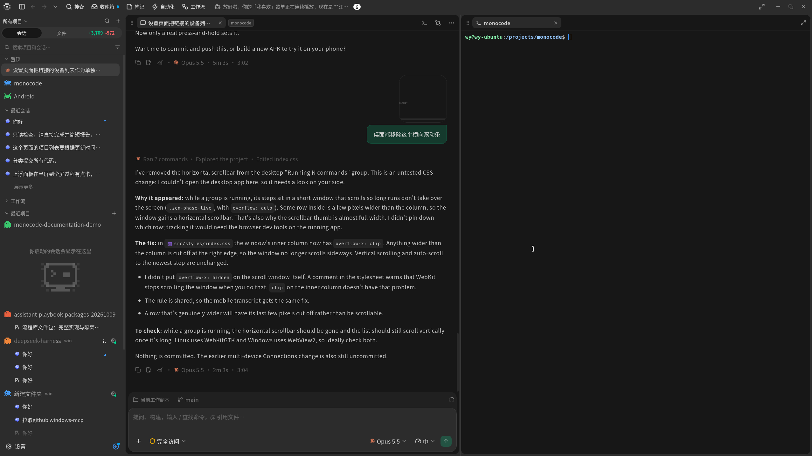
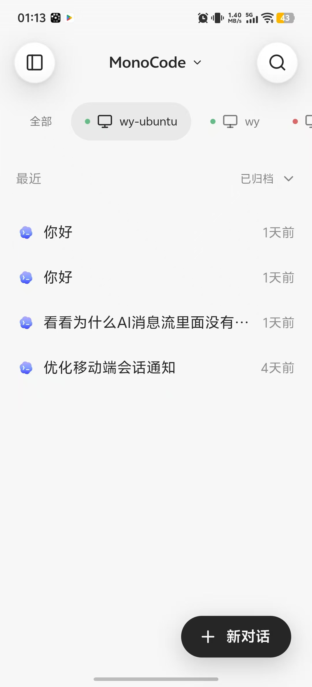

<p align="center">
  
</p>

<h1 align="center">ohmymonocode</h1>

<p align="center">编程智能体与个人助理的桌面及移动工作区。</p>

[English](README.md) · [简体中文](README.zh-CN.md)

这是 [MonoCode](https://github.com/hardbeat920/monocode) 的个人 fork，围绕中文体验、桌面与移动端协作、个人助理功能持续改进。由个人独立维护，感谢上游作者与贡献者。



<p align="center">
  
</p>

## 功能

- **多智能体**：在同一工作区使用已安装的 Claude Code、Codex、OpenCode、Pi、omp 等工具。
- **项目工作区**：会话、分屏、终端、文件、Git 分支与 worktree。
- **个人助理**：委派任务、关注会话、管理提醒和编辑记忆。
- **桌面与移动端**：通过共享 Host，在不同设备访问项目会话。
- **日常工具**：笔记、收件箱、自动化与工作流，支持中文和英文界面。

## 开始使用

先安装并登录至少一个支持的智能体 CLI。从源码运行桌面端需要 Node.js 24+、稳定版 Rust 工具链，以及对应系统的 Tauri 原生依赖。

```bash
git clone https://github.com/yyy0107/ohmymonocode.git
cd ohmymonocode
npm ci
npm run tauri dev
```

Linux 用户先安装原生依赖：Ubuntu/Debian 使用 `npm run setup:linux:deb`，Fedora 使用 `npm run setup:linux:fedora`。

移动端按[设置指南](mobile/README.md)操作，使用 Host 地址与设备 token 连接。界面语言可在 **设置 → 通用 → 语言** 中切换。

## 文档

- [共享会话](docs/shared-sessions.md)
- [远程访问](docs/remote-access.md)
- [移动端设置与构建](mobile/README.md)
- [助理评测](host/assistant/eval/README.md)
- [手动刷新开发环境](scripts/dev-refresh.md)

## 许可

采用 [MIT](LICENSE) 许可，保留原项目 MonoCode 的署名。服务商名称与标志属于各自权利人，见 [NOTICE](NOTICE)；评测数据遵循各自来源的许可。
