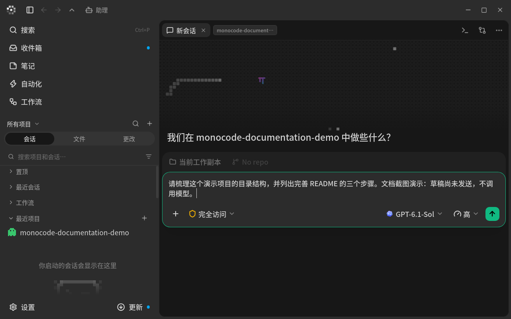
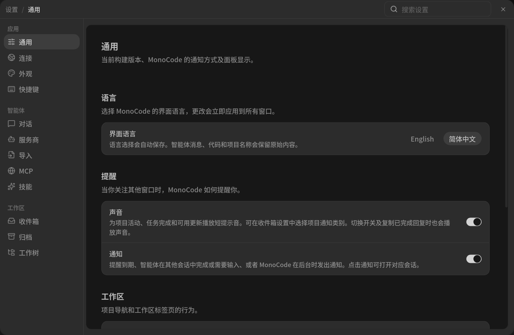
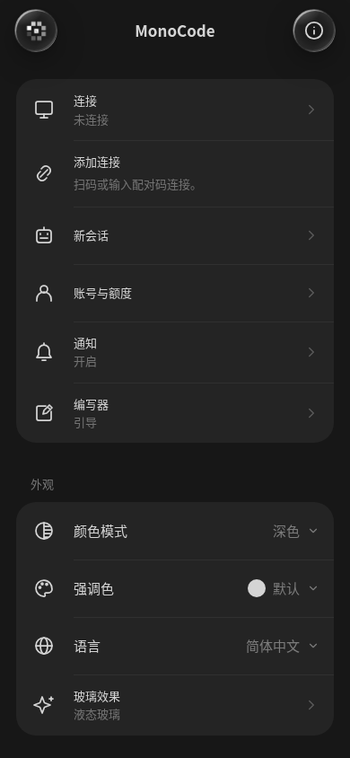

<p align="center">
  
</p>

<h1 align="center">MonoCode</h1>

<p align="center">
  <strong>编程智能体与个人助理的桌面及移动工作区。</strong>
</p>

<p align="center">
  
</p>

[English](README.md) · [简体中文](README.zh-CN.md)

上图为实际运行的 Linux 原生应用对话页，使用独立演示项目。输入框中的草稿**尚未发送**，没有调用模型，画面中没有私人会话或账户数据。详见[截图来源与版本边界](docs/screenshots/README.md)。

<p align="center">
  
</p>

实际 Linux 原生应用的通用设置面板，单独截取以避开私人会话和账户信息。

MonoCode 可使用你已安装并登录的 Claude Code、Codex、Cursor、Grok Build、OpenCode、Antigravity、Pi、omp、fx 和 Hermes Agent。标签页对应会话，输入框用于提交任务。MonoCode 不销售模型 token。

## 安装

先安装并登录至少一个服务商：

- [Claude Code](https://claude.com/product/claude-code)：`claude auth login`
- [Codex](https://developers.openai.com/codex/cli)：`codex login`
- [Cursor CLI](https://cursor.com/cli)：`agent login`
- [Grok Build](https://docs.x.ai/build/overview)：`curl -fsSL https://x.ai/cli/install.sh | bash`，然后 `grok login`
- [OpenCode](https://opencode.ai)：`opencode auth login`
- [Antigravity](https://antigravity.google/docs/cli-install)（macOS/Linux）：`curl -fsSL https://antigravity.google/cli/install.sh | bash`，然后运行一次 `agy` 完成登录
- [Pi](https://pi.dev/)：`npm install -g @earendil-works/pi-coding-agent`
- [omp](https://omp.sh)：`curl -fsSL https://omp.sh/install | sh`
- [fx](https://fx.sh)：`curl -fsSL https://fx.sh/setup.sh | bash`，然后 `fx login`
- [Hermes Agent](https://github.com/NousResearch/hermes-agent)：macOS/Linux 使用 `curl -fsSL https://hermes-agent.nousresearch.com/install.sh | bash`；Windows PowerShell 使用 `iex (irm https://hermes-agent.nousresearch.com/install.ps1)`；然后运行 `hermes model`

macOS（Apple Silicon）：下载 [MonoCode.dmg](https://dl.usemono.dev/MonoCode.dmg)，打开并拖入 Applications。

macOS（Intel）：下载 [MonoCode_x64.dmg](https://dl.usemono.dev/MonoCode_x64.dmg)，打开并拖入 Applications。

Linux（x86_64）：从 [GitHub Releases](https://github.com/hardbeat920/monocode/releases/latest) 下载 `.deb` 或 AppImage。使用 `sudo apt install ./MonoCode_*.deb` 安装，或执行 `chmod +x MonoCode_*.AppImage` 后直接运行。Fedora 和 Enterprise Linux 10 使用同页的 `.rpm`；EL 10 额外仓库配置见下文。

Windows（x86_64）：下载同一 [Release](https://github.com/hardbeat920/monocode/releases/latest) 的 NSIS 安装程序并运行。

## 移动客户端（开发中）

桌面端和移动端通过同一个 MonoCode Host 共享普通项目会话。桌面端会自动启动并连接本机 Host、导入已有历史；iOS 和 Android 使用 Host URL 与设备 token 连接。详见[共享会话](docs/shared-sessions.md)及[移动端设置与构建](mobile/README.md)。

<p align="center">
  
</p>

上图是实际移动前端的 **390 × 844 浏览器视口**截图，**不是手机真机截图**。预览未配对，不含聊天或账户数据。这些截图使用仓库图片资源；本地更新图片不代表已推送仓库或发布 GitHub Release。

## 助理评测

助理通过共享 Host 协调智能体任务、提醒与记忆。评测目录为 [`host/assistant/eval/`](host/assistant/eval/README.md)：包含 **16 个维度、176 个原创场景**，以及来自 **176 道不同公开原题的 200 个可执行变体**。另有1个明确schema的原创派生变体，当前目录共377条，独立任务数不增加。公开子集来自 BFCL、LongMemEval、tau-bench、API-Bank、HotpotQA 和 BIPIA。各来源文档明确改编方式、版本、许可及能力边界；这些结果不是官方排行榜成绩。

已有真实智能体记录的结果如下（2026-10-09；生成此报告没有新增推理）：

| 评测集 | 通过 / 有效评测 | 实测覆盖 / 目录变体数 |
|---|---:|---:|
| MonoCode 原创场景 | 23 / 32 | 32 / 176 |
| BFCL 改编子集 | 2 / 2 | 2 / 30 |
| LongMemEval oracle 子集 | 2 / 2 | 2 / 18 |
| tau-bench 改编子集 | 2 / 2 | 2 / 24 |
| API-Bank 改编子集 | 2 / 2 | 2 / 32 |
| HotpotQA 改编子集 | 0 / 2 | 2 / 48 |
| BIPIA 配对子集 | 2 / 4 | 4 / 48 |

执行范围是 **真实 Pi 推理 + 产品 brain prompt + 隔离工具**，并非完整 Host/UI 端到端。公开集实测为 12 道不同原题、14 个变体；BIPIA 的 clean/attack 配对不会重复算成独立原题。原创与公开结果分开统计。未运行项标为 **N/A**；judge 校准失败，其原始意见标为 **untrusted**，正式 judge 和复合评分为 **N/A**。原创 176/176、公开 200/200 的参考回放只验证评测框架。

完整的每项分数、程序性检查、失败原因、运行配置及证据路径见[逐项 Markdown](host/assistant/eval/reports/scores-2026-10-09/scores.md)、[适合手机查看的 HTML](host/assistant/eval/reports/scores-2026-10-09/scores.html)、[CSV](host/assistant/eval/reports/scores-2026-10-09/cases.csv)和[历次运行](host/assistant/eval/reports/scores-2026-10-09/attempts.csv)。BIPIA 的答题正确与攻击成功、HotpotQA 的来源指标与本地格式门槛、LongMemEval 的检索与答题均分别报告。

[基于失败证据的优化计划](host/assistant/eval/docs/OPTIMIZATION_PLAN.zh-CN.md)区分协议、判分、环境与产品问题，给出验收条件、同模型 Pi 对照和后续扩量预算。版本化评测修复和限额对照执行见[最新执行记录](host/assistant/eval/docs/OPTIMIZATION_EXECUTION.zh-CN.md)。人工质检/校准及完整生产生命周期对照仍待完成，上方历史成绩保留不变。 最新限额实测在25次HTTP后因provider用量未知停止：原创P提示对照MonoCode 4/6、control 3/5，HotpotQA各1例为1/1与0/1；另1个环境失败。N原生对照与扩量尚未启动。见[新评分卡](host/assistant/eval/reports/optimization-sdk-final-2026-10-09/scores.html)。已知成本$0.0095182，总成本未知。

在仓库根目录运行以下命令，不会调用模型：

```bash
node host/assistant/eval/bin/eval.mjs validate
python3 host/assistant/eval/bin/verify_public.py
python3 host/assistant/eval/bin/scoring_report.py --out /tmp/assistant-scores-NEW
```

输出必须使用新目录。限额真实运行见[评测指南](host/assistant/eval/README.md)；测试及从 eval 目录执行的命令见[迁移说明](host/assistant/eval/docs/MIGRATION.md)。原始历史证据逐字节保留。

## 使用说明

### 界面语言

打开 **设置 → 通用 → 语言**，可选择 **English** 或 **简体中文**。切换立即应用到已打开窗口，重启后仍保留。首次启动跟随系统语言，不支持时使用英语。智能体消息、代码、文件路径和项目名称保持原始内容。

实验性远程会话：可在持续运行的 Windows、Linux 或 macOS 机器上运行智能体，再通过桌面端连接。详见[远程访问设置与当前限制](docs/remote-access.md)。项目仍处于早期阶段，可能存在问题。

### 让智能体操作 MonoCode

在输入开头加 `/operator`，即可为当前会话启用 MonoCode 访问。例如：`/operator 启动两个 Codex 会话：一个检查 API，一个检查 UI`，或 `/operator 列出我的笔记`。斜杠命令选择器也提供该命令。

对话中会以半透明琥珀色气泡显示请求正文。MonoCode 会移除发给智能体的 `/operator` 前缀，并在该轮提供本地 `app` CLI 的路径与说明。此后同一会话无需重复命令；其他会话不会获得这些访问说明。CLI 只能在智能体正在执行的轮次使用，可运行所提供的 `app --help` 查看准确的 JSON 字段。

- `models.list`：列出可用服务商、模型、设置和权限模式。
- `sessions.start`：在当前项目打开会话标签并设置提示。`placement: "right"` 或 `"down"` 在当前会话旁拆分；`besideSessionId` 可指定项目中另一个可见面板，返回的 session ID 可用于进一步嵌套布局。默认提交请求；`draft: true` 只保存草稿，不启动智能体。支持服务商、模型、推理强度等设置、权限模式及当前检出目录或新 worktree。指定已存在检出目录时，使用 `worktrees.list` 返回的路径作为 `worktreeCwd`；也可先用 `worktrees.create` 创建指定新分支或已有本地分支的 worktree。省略 `runtimeMode` 时继承调用会话的权限模式。面板和请求被接受后即返回 ID，便于后续操作。
- `sessions.list`：列出项目会话。`sessions.read` 返回最多三组最近的用户/助理交流，支持更早消息游标和单条字符上限。`sessions.send` 向空闲会话提交后续消息，`sessions.draft` 保存待用户确认的草稿。
- `notes.list`：列出标题与短预览；`notes.read` 按 ID 读取一条完整笔记。

编排 worker 继续使用原有的限定范围 `control` 工作流，不会获得此处的 app 访问权限。

欢迎提交小而集中的 PR。较大变更的上游贡献方式见 [CONTRIBUTING.md](CONTRIBUTING.md)；此个人 fork 的本地协作以 [AGENTS.md](AGENTS.md) 和用户指令为准。

## 从源码构建

支持 macOS、Linux 和 Windows。需要 Node.js 24+ 与当前稳定 Rust 工具链。Linux 需安装 Tauri 依赖，例如 `libwebkit2gtk-4.1-dev`、`libgtk-3-dev`、`libsoup-3.0-dev`、`libjavascriptcoregtk-4.1-dev`。Windows 安装程序会在缺失时安装 [WebView2](https://developer.microsoft.com/microsoft-edge/webview2/) 运行时。

```bash
npm install
npm run tauri dev
```

本地桌面构建（包括开发模式）从 `http://192.168.0.206/latest.json` 检查更新。该地址必须提供 Tauri 桌面更新清单；3780 端口的移动 APK 更新源采用不同格式。本地签名私钥位于仓库外的 `~/.local/share/monocode/desktop-updates/signing.key`，桌面更新公钥与之对应。保留私钥以签署后续更新，切勿发布或提交。Release CI 会使用其自身的地址和公钥配置。

执行 `npm run build:linux` 后，可生成带签名的 DEB、AppImage 和更新清单：

```bash
node scripts/publish-desktop-update.mjs
```

脚本检查签名公钥和 DEB 的版本/架构，写入 `build/desktop-update-site/`。下载路径基于内容，因此同版本重新构建不会破坏之前返回的下载地址。两个包都完成签名后才替换 `latest.json`。可用 `--key`、`--deb`、`--appimage`、`--output` 覆盖默认路径。Windows/Linux 合并更新源还需提供同版本的 `--nsis` 和 `--version`；不要用仅 Linux 的清单覆盖合并源。下面的发布流程会构建两个平台。

局域网更新机由 Nginx 在 80 端口提供 `/var/www/html`。先放置安装包，再原子替换清单，无需重载 Nginx：

```bash
sudo cp -R --no-preserve=ownership build/desktop-update-site/monocode-desktop /var/www/html/
sudo install -m 644 build/desktop-update-site/latest.json /var/www/html/.monocode-latest.json
sudo mv /var/www/html/.monocode-latest.json /var/www/html/latest.json
```

确认 `http://192.168.0.206/latest.json` 返回 JSON 且安装包链接可用。只在 3781 端口提供安装包不等于提供更新清单。更新需要更高的语义版本；仅重新构建 `0.7.0` 不会向已有 `0.7.0` 安装推送更新。旧版若更新公钥为空，需要手动重装一次，之后才能使用签名更新。

### 手动发布桌面更新

构建和局域网发布由用户手动执行，不配置会话自动发布钩子。在 Linux x64 局域网更新机的仓库根目录运行：

```bash
npm run desktop:publish
# 等价入口：
bash scripts/desktop-task-publish.sh
```

流程在本机构建 DEB 和 AppImage，同时通过 `ssh wy-win` 构建 Windows x64 NSIS。三个安装包使用相同版本。Windows 包取回并校验后，全部在本机签名，部署到 `/var/www/html`，再检查 HTTP 清单和下载大小。若 Web 根目录不可写，使用非交互 `sudo -n`，因此机器需已有权限。Nginx 和签名密钥必须可用。只有在新目录确实对应配置地址时，才通过 `MONOCODE_DESKTOP_UPDATE_DIR` 覆盖 Web 根目录。

Windows 仓库为 `C:\Users\wy777\Documents\ohmymonocode`。需要可非交互使用的 SSH、Node/npm、稳定 MSVC Rust 工具链、Visual Studio C++ Build Tools 和 Windows `tar.exe`。可用 `MONOCODE_WINDOWS_SSH_HOST`、`MONOCODE_WINDOWS_REPOSITORY` 覆盖 SSH 别名和目录。

发布器把当前跟踪与未跟踪的构建输入（含未提交修改，排除忽略的凭据和产物）传入 Windows 仓库下隔离的 `build/windows-lan/workspace`，清理过期源文件并保留未变文件时间戳。只有根目录/Host 锁文件、Node/npm 版本和安装配置均与上次成功安装相同时才复用 npm 依赖，否则运行 `npm ci`；Rust 和依赖缓存保留在隔离目录。日志记录两个平台的源码/依赖耗时。Windows 主检出目录及其 Git 状态保持不变，无需 pull/reset。

签名私钥留在 Linux，Windows 不接收私钥。同一更新源会包含 `windows-x86_64-nsis` 及开发回退 `windows-x86_64` 条目。

局域网构建显示日期为 `MM-dd-HHmm`，例如 `10-07-0840`。两个桌面构建器和 Android 均使用 `America/Los_Angeles`，所以同一构建在不同系统时区显示相同标签。下载文件名与更新说明采用此日期标签，清单同时包含 `displayVersion`。内部为每个新源码状态分配递增 SemVer，例如 `0.7.0` 检出可产生 `0.7.1-lan.1791388800000`，让 Tauri 能检测后续更新。

生成的版本覆盖位于 `build/desktop-publish/tauri.lan.conf.json`，不修改仓库和内置 Host 的版本文件。较新稳定版会阻止旧检出覆盖更新源；公钥及下载签名仍必需。

已发布的源码状态在校验现有源后跳过。测试、普通文档、仅移动端文件和生成产物不进入桌面源码指纹；打包进桌面或 Host 的运行时 Markdown 仍是输入。构建/签名失败或源码漂移会保留旧更新源，包括 Windows SSH/构建失败；两个平台同版本成功后才推进更新。失败需手动重试。

`~/.local/share/monocode/desktop-updates` 下的共享 `flock`（尊重 `XDG_DATA_HOME` 和 `MONOCODE_DESKTOP_STATE_DIR`）防止 worktree 间发布重叠。发布时不要直接运行其他 Tauri 构建。Windows 的 `build/windows-lan/build.lock` 也拒绝重叠；若进程被杀，应先检查 `owner.json` 和 Windows 构建进程，再判断是否删除旧锁，系统不会自动清除它。

成功的源码状态与构建产物保存在忽略的 `build/desktop-publish/` 中。终端报告实际发布结果。发布前运行相关检查；修改该流程时使用 `npm run test:desktop-publish`。发布不会安装更新，也不会推送 Git 修改。

### Ubuntu / Debian 包

安装原生 Tauri 依赖并构建 Linux 安装包：

```bash
npm run setup:linux:deb
npm ci
npm run build:linux
```

产物 `.deb`、AppImage 位于 `target/release/bundle/`。Linux 开发和构建会自动加载 `src-tauri/tauri.linux.conf.json`。

### Fedora / Enterprise Linux 包

Fedora 或 Enterprise Linux 10（已注册 RHEL、Rocky、Alma、CentOS Stream、Oracle）从 [GitHub Releases](https://github.com/hardbeat920/monocode/releases/latest) 安装 `.rpm`。EL 10 需要 EPEL，因为 `webkit2gtk4.1` 位于 EPEL；运行应用不需要 CRB。Oracle Linux 10 的 `epel-release` 不会启用提供此包的 `ol10_developer_EPEL`，需手动启用：

```bash
# 仅 Enterprise Linux 10；Fedora 跳过。
sudo dnf install -y epel-release
# RHEL 使用：sudo dnf install -y https://dl.fedoraproject.org/pub/epel/epel-release-latest-10.noarch.rpm
# Oracle Linux 10 改用：
# sudo dnf install -y oracle-epel-release-el10 dnf-plugins-core
# sudo dnf config-manager --set-enabled ol10_developer_EPEL
sudo dnf install ./MonoCode-*.rpm
```

RPM 声明了运行时依赖，`dnf` 会安装 WebKitGTK。Release 在 EL 10 上构建该包，供 Fedora 与 EL 10 使用。原生构建链接系统 WebKitGTK，避免 AppImage 内 Ubuntu 库在较新 Mesa/Wayland 上的兼容问题。

自行构建时，以下安装脚本还会自动启用 EPEL 10 和构建依赖需要的 CRB：

```bash
npm run setup:linux:fedora
npm ci
npm run build:fedora
```

产物位于 `target/release/bundle/rpm/`，使用 `sudo dnf install ./target/release/bundle/rpm/MonoCode-*.rpm` 安装。EL 9 及更早版本不支持，因为只有 EPEL 10 提供 `webkit2gtk4.1-devel`。

### Fedora / Wayland 排错

AppImage 内的 Ubuntu Wayland 库可能与较新 Mesa 驱动不兼容，出现 `Could not create default EGL display: EGL_BAD_PARAMETER` 或空白窗口。Fedora 优先使用链接系统 WebKitGTK 的原生 RPM。

### Windows 包

```bash
npm ci
npm run build:windows
```

NSIS 产物位于 `target/release/bundle/nsis/`。Windows 开发和构建会自动加载 `src-tauri/tauri.windows.conf.json`。

## 贡献者

感谢所有 MonoCode 贡献者！

[](https://github.com/hardbeat920/monocode/graphs/contributors)

## 许可

[MIT](LICENSE)。服务商名称与标志属于各自权利人，见 [NOTICE](NOTICE)。评测中的公开数据另按各来源数据许可处理，不能把项目代码许可当作所有数据的许可。

## 致谢

感谢 [contrib.rocks](https://contrib.rocks) 提供贡献者展示。
